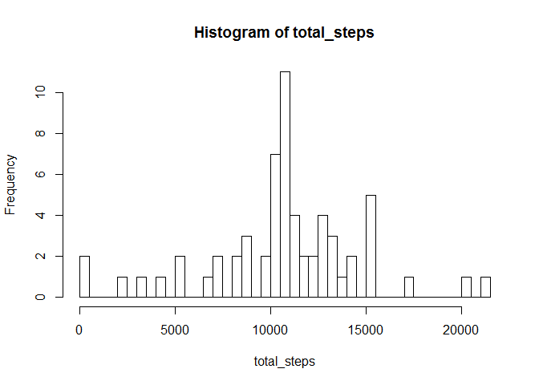

# Reproducible Research: Peer Assessment 1


## Loading and preprocessing the data

```r
df <- read.csv("activity/activity.csv")

df_complete <- data.frame(integer(1), integer(1), integer(1))
colnames(df_complete) <- colnames(df)

for(n in 1:nrow(df)){
        if(!is.na(df$steps[n])){
                df_complete <- rbind(df_complete, df[n,])
        }        
}

df_complete <- df_complete[-1,]
rownames(df_complete) <- NULL
```

## What is mean total number of steps taken per day?

```r
total_steps <- tapply(df_complete$steps, df_complete$date, sum)
```
The following graph shows the histogram for the mean total number of steps taken per day:

```r
hist(total_steps, breaks = 50)
```

 

The mean number of total steps is:

```r
mean(total_steps)
```

```
## [1] 10766.19
```
The median for total steps is:

```r
median(total_steps)
```

```
## [1] 10765
```


## What is the average daily activity pattern?

```r
daily_pattern  <- tapply(df_complete$steps, df_complete$interval, mean)
```
The following graph shows the daily activity pattern:

```r
plot(rownames(daily_pattern), daily_pattern, type = 'l', xlab = '5-minute intervals', ylab='average number of steps taken')
```

 

The maximum activity is:

```r
max(daily_pattern)
```

```
## [1] 206.1698
```
and occurs in the following interval:

```r
rownames(daily_pattern)[which.max(daily_pattern)]
```

```
## [1] "835"
```


## Imputing missing values
There are 

```r
nrow(df)-nrow(df_complete)
```

```
## [1] 2304
```
missing values. 

We impute missing values by filling in the mean value for the corresponding interval:

```r
df_imputed <- df

for(n in 1:nrow(df_imputed)){
        if(is.na(df_imputed$steps[n])){
                df_imputed$steps[n] <- daily_pattern[which(rownames(daily_pattern)==df_imputed$interval[n])]
        }        
}

total_steps <- tapply(df_imputed$steps, df_imputed$date, sum)
```
The following graph shows the histogram after imputing missing values. It looks different from the first histogram:

```r
hist(total_steps, breaks = 50)
```

 

The mean number of total steps is:

```r
mean(total_steps)
```

```
## [1] 10766.19
```
The median for total steps is:

```r
median(total_steps)
```

```
## [1] 10766.19
```

## Are there differences in activity patterns between weekdays and weekends?

```r
df_imputed$weekday <- weekdays(as.Date(df$date))

df_imputed$weekday[which(!(df_imputed$weekday == 'Saturday' | df_imputed$weekday == 'Sunday' ))] <- 'weekday'
df_imputed$weekday[which(df_imputed$weekday == 'Saturday' | df_imputed$weekday == 'Sunday' )] <- 'weekend'

weekend_pattern  <- tapply(df_imputed[which(df_imputed$weekday=='weekend'),]$steps, df_imputed[which(df_imputed$weekday=='weekend'),]$interval, mean)

weekday_pattern  <- tapply(df_imputed[which(df_imputed$weekday=='weekday'),]$steps, df_imputed[which(df_imputed$weekday=='weekday'),]$interval, mean)
```
The following graphs show the activity patterns on weekends and weekdays. It can be seen that there are differences in the activity pattern, e.g., on weekends there is more activity throughout the day where as the activity in the early morning is higher on weekdays:

```r
par(mfrow = c(2,1))
plot(rownames(weekend_pattern), weekend_pattern, type = 'l', xlab = '5-minute intervals', ylab='# steps (weekend)')
plot(rownames(weekday_pattern), weekday_pattern, type = 'l', xlab = '5-minute intervals', ylab='# steps (weekday)')
```

 
